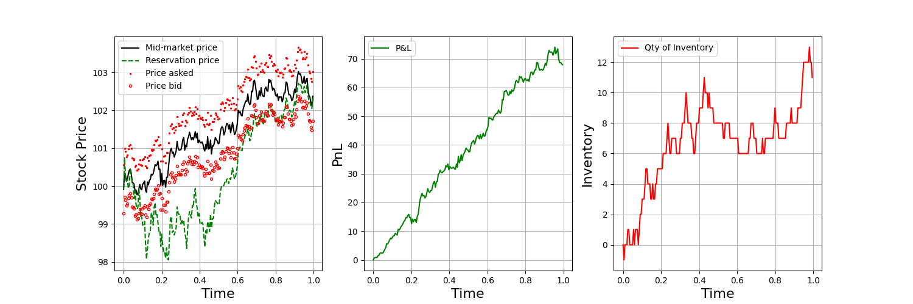

# Implementation of Avellaneda-Stoikov market making model

My implementation of the seminal work by [Avellaneda-Stoikov (2008)](https://www.researchgate.net/publication/24086205_High_Frequency_Trading_in_a_Limit_Order_Book)


Several References that helped me along the way
[Hummingbot technical deep dive](https://hummingbot.io/blog/2021-04-avellaneda-tech-deepdown)
[Hummingbot guide](https://hummingbot.io/blog/2021-04-avellaneda-stoikov-market-making-strategy)
[fedecaccia's implementation](https://github.com/fedecaccia/avellaneda-stoikov)

# Instructions
```python
pip install -r requirements.txt
python avellaneda_stoikov_model.py
```

# Results
## Symmetric Strategy

## Inventory Strategy


# Some notes

Some of the paper assumptions are:
1. Volatility is constant
2. Order book statistical nature is constant

Depending on the markets, for example crypto, the assumptions might not hold. Hummingbot seems to have made some extensions to these assumptions and more, might be worth checking out
